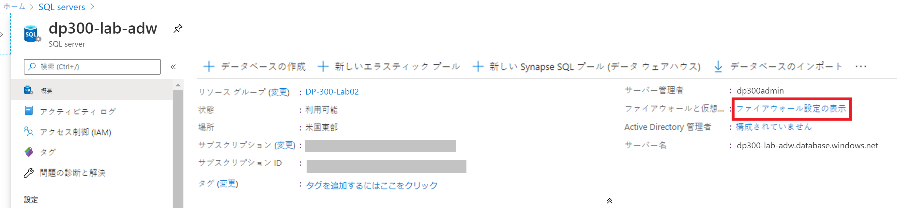
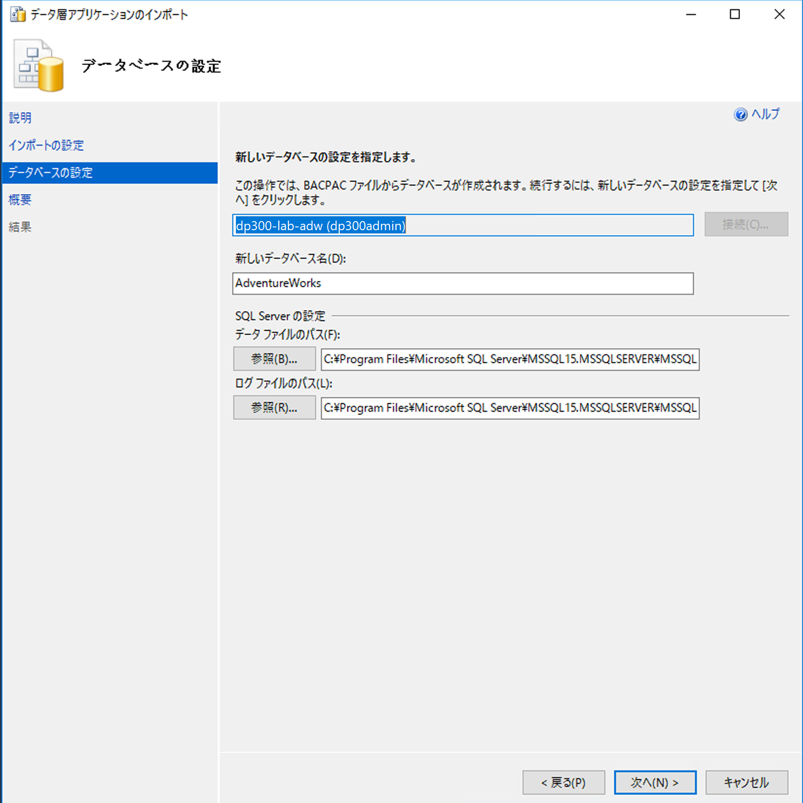
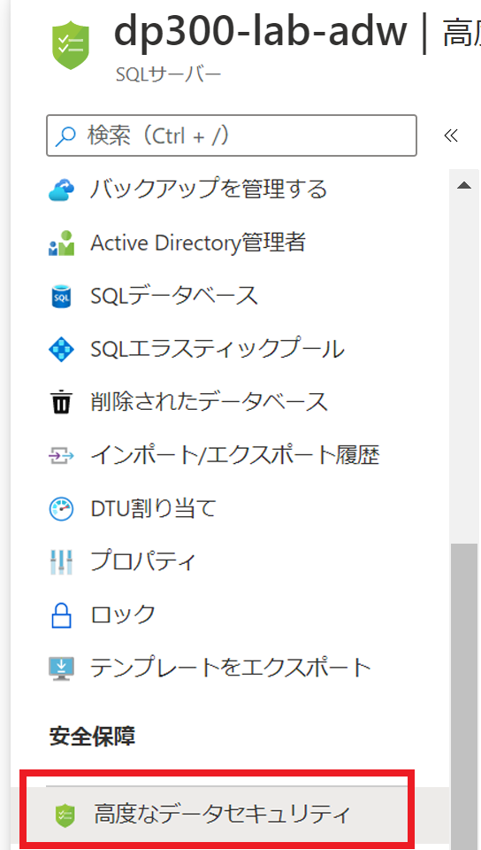
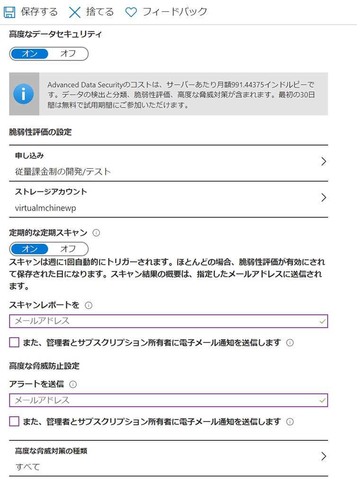
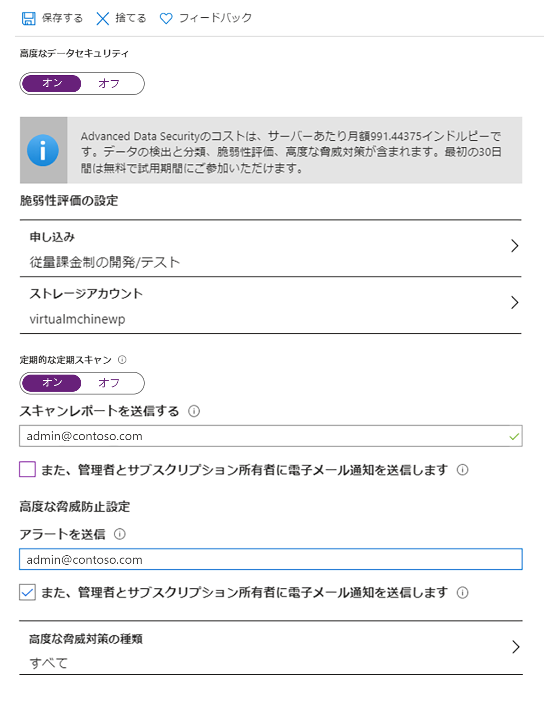
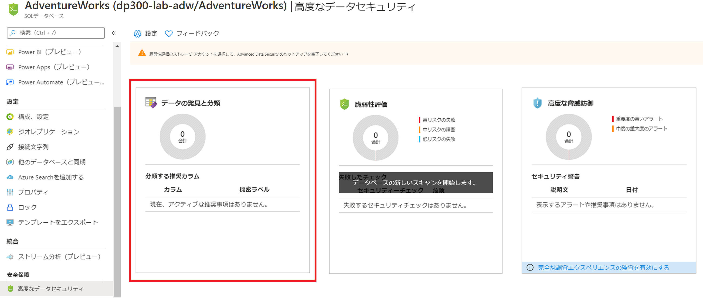

---
lab:
    title: 'ラボ 3 - 安全な環境を実装する'
    module: '安全な環境を実装する'
---

# ラボ 3 – 安全な環境を実装する
 

**予想時間**: 60 分

**前提条件**: モジュール２のラボで作成した Azure SQL Server。サブスクリプションでの Azure Active Directory へのアクセス。 

**ラボ ファイル**: このラボのファイル は、D:\Labfiles\Secure Environment フォルダーにあります。

# ラボの概要

受講者は、レッスンとケース スタディで得た情報を利用して、Azure portal と AdventureWorks データベース内でセキュリティを構成して実装します。 

# ラボの目的

このモジュールを修了すると、次のことができるようになります。

1. Azure SQL Database のファイアウォールを構成する

2. Azure Active Directory で Azure SQL Database へのアクセスを承認する

3. Azure SQL Database の Advanced Threat Protection を有効化する

4. Azure SQL Database のデータ分類の実装

5. データベース オブジェクトへのアクセスの管理

# シナリオ

データベース環境のセキュリティを確保するために、シニア データベース管理者として採用されました。これらのタスクは、Azure SQL Database に焦点を当てます。 

 

## 演習 1: Azure SQL Database のファイアウォールを構成する 

予想時間: 30 分

個別演習

この演習の主なタスクは次のとおりです。

1. Azure portal を使用してサーバーベースのファイアウォール ルールを構成する

2. データベースをデプロイする

3. T-SQL を使用してデータベース ファイアウォール ルールを追加する

4. データベース固有の接続文字列を使用したデータベースへの接続

## タスク 1:    Azure portal を使用してサーバーベースのファイアウォール ルールを構成する

1. ラボの仮想マシンからブラウザー セッションを開始し、[ https://portal.azure.com ](https://portal.azure.com/) に移動します。適切な資格情報を提供します。 

	

2. Azure portal の最上部にある検索ボックスで、「SQL」とタイプします。「SQL サーバー」 のアイコンが表示されます。「SQL サーバー」 をクリックします。ラボ２で作成したサーバーの詳細ページに移動するには、「サーバー名」 をクリックします


	

 

3. SQL サーバーの 「詳細画面」 で、マウスを 「サーバー名」 の右に移動し、以下に示すように 「クリップボードにコピー」 ボタンをクリックします。


	

4. クリックしてクリップボードにコピーしたサーバー名の上にある、「ファイアウォール設定の表示」 をクリックします。以下で強調表示されている 「+ クライアントIP」 をクリックしてから、「保存」 をクリックします。

 

	

	これにより、SQL Server Management Studio またはその他のクライアントツールを使用して、Azure SQL Database サーバーに接続できます。クライアントの IP アドレスをメモしてください。このタスクの後半で使用します。

5. 「スタート」 メニューから 「Microsoft SQL Server ツール18 」 > 「SQL Server Management Studio」 に移動して、ラボ VM で SQL Server Management Studio を開きます。Azure SQL Database サーバーの名前を貼り付け、ラボ 2 で作成した資格情報でログインします。

	- サーバー管理者のログイン: **dp300admin**

	- パスワード: **dp300P@ssword!**

 
	

	「接続」 をクリックします。

6. オブジェクト エクスプローラーでサーバーノードを展開し、「データベース」 を右クリックします。「データ層アプリケーションのインポート」 をクリックします。

	

 
7. 「データ層アプリケーションのインポート」 ダイアログで、最初の画面で 「次へ」 をクリックします。 

 
	

 

8. 「設定のインポート」 画面で、「参照」 をクリックして D:\Labfiles\Secure Environment フォルダーに移動し、AdventureWorks.bacpac ファイルをクリックし、「開く」 をクリックします。次に、「データ層アプリケーションのインポート」 画面で、 「**次へ**」 をクリックします。

	

	

 

9. 「データベース設定」 画面で、Azure SQL Database のエディションを General Purpose に変更します。サービス目標を **GP_Gen5_2** に変更し、「次へ」 をクリックします。[スクリーンショットで示されている **GP_Gen4_2** は 2020 年 8 月以降はご利用いただけない点にご留意ください。」

 

	

 

10.  「**次へ**」 をクリックしてから、サマリ画面で 「**終了**」 をクリックします。インポートが完了すると、以下の結果が表示されます。
	


11. オブジェクト エクスプローラーで、AdventureWorks を右クリックし、「新しいクエリ」 をクリックします。 

 

	

 

12. テキストをクエリ ウィンドウに貼り付け、192.168.1.1. をステップ 4 で取得したご自分のクライアント IP アドレスに置き換えて、以下の T-SQL クエリを実行します。「実行」 をクリックするか、F5 を押してください。

	```sql
	EXECUTE sp_set_database_firewall_rule @name = N'ContosoFirewallRule',

	@start_ip_address = '192.168.1.1', @end_ip_address = '192.168.1.1'
	```
	

	次に、AdventureWorks データベースに含まれるユーザーを作成します。「新しいクエリ」 をクリックして、次の T-SQL を実行します。まだ AdventureWorks データベースを使用していることを確認してください。下の強調表示されたボックスに 「マスター」 が表示されている場合は、プルダウンして、[AdventureWorks」 に切り替えることができます。


	

13. 「実行」 をクリックしてクエリを実行します。このコマンドは、AdventureWorks データベース内に含まれるユーザーを作成します。次のステップで、ユーザー名とパスワードを使用してログインします。

	```sql
	CREATE USER containeddemo WITH PASSWORD = 'P@ssw0rd!'
	```


14. SSMS でオブジェクト エクスプローラーに移動し、「接続」、「データベース エンジン」 の順にクリックします

	

15. . ステップ 13 で作成した資格情報を使用して接続を試みます。次のエラーが表示されます。


	

	これは、ユーザーが作成された AdventureWorks ではなく、マスター データベースに接続しようとしたためです。「OK」 をクリックして接続コンテキストを変更し、エラー メッセージを終了して、次に示すように 「サーバーに接続」 ダイアログ ボックスのオプションをクリックします。


	


16. 「接続オプション」 タブで、「AdventureWorks」というデータベース名を入力します。


	


17. その画面から 「接続」 をクリックします。この接続はマスター データベースをバイパスし、AdventureWorks に直接ログインします。これは、新しく作成されたユーザーがアクセスできる唯一のデータベースです。

	

## タスク 2: Azure Active Directory で Azure SQL Database へのアクセスを承認する

1. Azure portal に移動し、画面の右上隅にあるユーザー名をクリックします。


	


	ユーザー名をメモしてください。 
	
	**注:** Azure SQL Database 向けの Azure Active Directory 管理者の場合、Microsoft アカウント (Outlook、Gmail、Hotmail、または Yahoo のユーザー アカウントなど) はサポートされていません。回避策として、「DBA」という名前のAzure Active Directory グループを作成し、ユーザー アカウントを追加することができます。また、タスク 2 をスキップすることも可能です。

 

2. Azure portal で Azure SQL Database サーバー dp300-lab-xxに移動し、Active Directory 管理者の横にある、「未構成」 をクリックします。


	


	次の画面で、「管理者の設定」 をクリックします。 


	

	「管理者の設定」 画面で、ユーザー名を検索します。見つかったら、それをクリックしてユーザー名を強調表示し、「選択」 をクリックします。上記の 「Active Directory管理画面」 に戻ります。「保存」 をクリックして、処理を完了します。これにより、以下に示すように、ユーザー名がサーバーの Azure Active Directory 管理者になります 


	


3. SQL Server Management Studio を開き、「接続」 > 「データベース エンジン」 をクリックします。サーバー名に自分のサーバーの名前を入力します。認証タイプをMFAで、Azure Active Directory Universal に変更します。


	

	

	Azure Active Directory のパスワードを入力するよう求められます。「**接続**」 をクリックしてデータベースにログインします。 

 

## タスク 3 Advanced Data Security とデータ分類を有効にする

1. Azure SQL サーバーのメイン ブレードから 「セキュリティ」 セクションに移動し、「Advanced Data Security」 をクリックします。 
 

	

	
	Advanced Data Security の下のトグル スイッチをクリックしてオンにします。ストレージ アカウントをクリックします。


	

	

	ストレージ アカウントを作成するように求められます。ラボ 1 で作成したストレージ アカウントを選択します。定期的なスキャンを実行するためのスイッチをオンに切り替えます。スキャン レポートとアラートを送信するメールアカウントを選択します。「管理者とサブスクリプション所有者に電子メールによる通知を送信する」というチェック ボックスをオフにします。
 


	

	Advanced Threat Detection タイプをクリックして、選択内容を確認します。すべてのチェック ボックスをオンのままにして、画面の上部にある 「**保存**」 をクリックします。


2. Azure SQL サーバーの概要画面を下にスクロールし、データベース名をクリックして、Azure portal の AdventureWorks データベースに移動します。 


	


3. Azure SQL Database のメイン ブレードの 「セキュリティ」 セクションに移動し、「Advanced Data Security」 をクリックします。Advanced Data Security 画面で、データ検出と分類をクリックします。


	

	次の画面で「分類の推奨事項がある 32 列が見つかりました」という情報メッセージが表示されます。そのリンクをクリックします。

	
	


	次の画面です。「すべて選択」 の横のチェック ボックスをクリックし、「選択した推奨事項を承認する」 をクリックします。 


	

	

	「**保存**」 をクリックして、分類をデータベースに保存します。 

 

4. VM で SQL Server Management Studio に戻ります。AdventureWorks データベースから新しいクエリ ウィンドウを起動し、次のクエリを実行します。

 
	```sql
	SELECT o.name AS [Table Name]

	,ac.name AS [Column Name]

	,sc.label

	,sc.information_type

	FROM sys.sensitivity_classifications sc

	INNER JOIN sys.objects o ON o.object_id = sc.major_id

	INNER JOIN sys.all_columns ac ON ac.column_id = sc.minor_id

	WHERE ac.object_id = o.object_id;
	```
	

	このクエリは、次に示すように、分類された列の結果を返します。

	

 

## タスク 4: データベース オブジェクトへのアクセスの管理

1. このタスクでは、データベースとそのオブジェクトへのアクセスを管理します。最初に、AdventureWorks データベースに 2 人のユーザーを作成します。新しいクエリ ウィンドウを開き、以下の T-SQL をコピーしてそのウィンドウに貼り付けます。クエリを実行して 2 人のユーザーを作成します。

```sql
CREATE USER [DP300User1] WITH PASSWORD = 'Azur3Pa$$'

GO

CREATE USER [DP300User2] WITH PASSWORD = 'Azur3Pa$$'

GO
```
 

これらのユーザーはデータベースのスコープ内で作成されることがわかります。したがって、これらのユーザーの 1 人でログインしようとする場合は、接続文字列で AdventureWorks データベースを指定する必要があります。


2. 次に、カスタム役割を作成して、それにユーザーを追加します。手順 1 と同じクエリ ウィンドウで次の T-SQL を実行します。

```sql
CREATE ROLE [SalesReader]

GO

ALTER ROLE [SalesReader] ADD MEMBER [DP300User1]

GO

ALTER ROLE [SalesReader] ADD MEMBER [DP300User2]

GO
```

3. 次に、ロールに権限を付与します。この場合、Sales スキーマに「SELECT」と「EXECUTE」を割り当てます。以下の T-SQL を実行して、ロールに権限を付与します。

```sql
GRANT SELECT, EXECUTE ON SCHEMA::Sales TO [SalesReader]

GO
```
 

4. 次に、Sales スキーマに新しいストアド プロシージャを作成します。この手順が Product スキーマのテーブルにアクセスすることを確認します。クエリ画面で以下の T-SQL を実行します。

```sql
CREATE OR ALTER PROCEDURE Sales.DemoProc

AS

SELECT P.Name, Sum(SOD.LineTotal) as TotalSales ,SOH.OrderDate 

FROM Production.Product P

INNER JOIN Sales.SalesOrderDetail SOD on SOD.ProductID = P.ProductID

INNER JOIN Sales.SalesOrderHeader SOH on SOH.SalesOrderID = SOD.SalesOrderID

GROUP BY P.Name, SOH.OrderDate

ORDER BY TotalSales DESC

GO
```
 

5. 次に、EXECUTE AS USER 構文を使用して、作成したセキュリティをテストします。これにより、データベース エンジンはユーザーのコンテキストでクエリを実行できます。クエリ画面で以下のクエリを実行します。

```sql
EXECUTE AS USER = 'DP300User1'


SELECT P.Name, Sum(SOD.LineTotal) as TotalSales ,SOH.OrderDate 

FROM Production.Product P

INNER JOIN Sales.SalesOrderDetail SOD on SOD.ProductID = P.ProductID

INNER JOIN Sales.SalesOrderHeader SOH on SOH.SalesOrderID = SOD.SalesOrderID

GROUP BY P.Name, SOH.OrderDate

ORDER BY TotalSales DESC
```
 

このクエリは失敗し、Production.Product テーブルに対する SELECT 権限が拒否されたことを示すエラーメッセージが表示されます。ユーザー DP300User1 がメンバーであるロールは、Sales スキーマでは SELECT 権限を持っていますが、Production スキーマでは持っていません。 


ただし、同じコンテキストでストアド プロシージャを実行すると、クエリは完了します。次の T-SQL を実行します。

```sql
EXECUTE AS USER = 'DP300User1'

EXECUTE Sales.DemoProc
```
 

これは、ストアド プロシージャが所有権チェーンと呼ばれる機能を利用して、データベース オブジェクトに直接アクセスする権限を持たないユーザーにデータ アクセスを提供するために発生します。同じ所有者を持つすべてのオブジェクトについて、データベース エンジンはプロシージャの EXECUTE 権限のみをチェックし、基になるオブジェクトはチェックしません。 


**このラボで作成されたリソースは、以降のラボの演習で使用されるため、削除しないでください。** 
