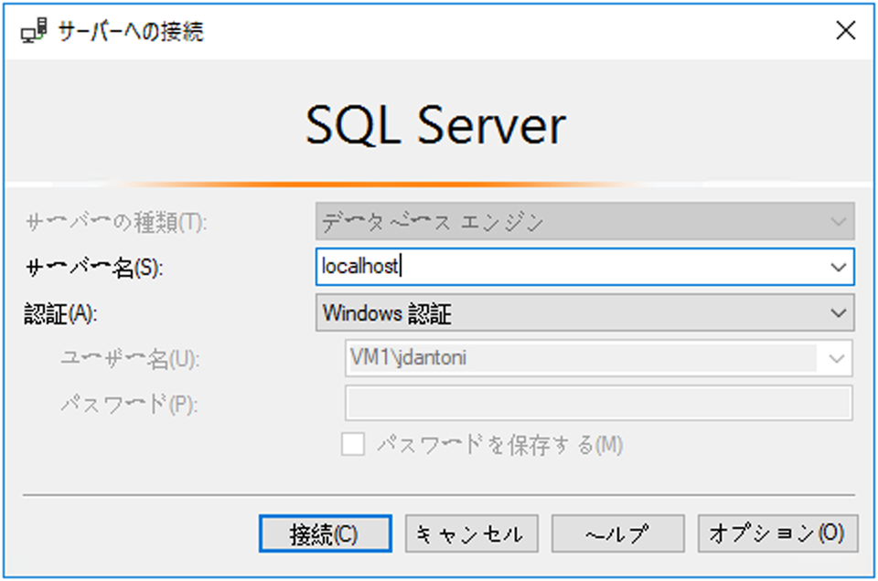
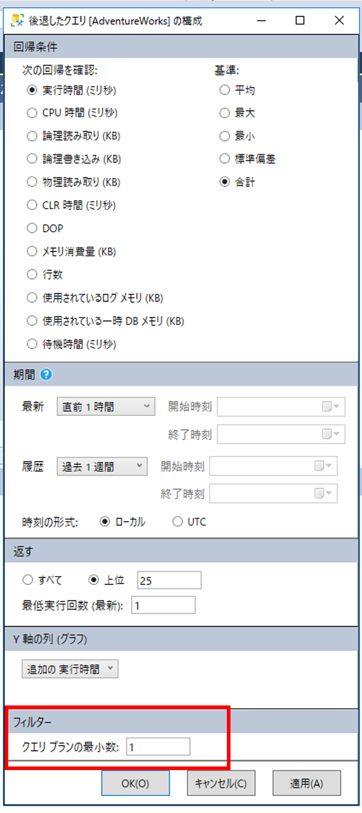

---
lab:
    title: 'ラボ 5 - クエリ パフォーマンスの問題解決'
    module: 'クエリ パフォーマンスの最適化'
---


# ラボ 5 - クエリ パフォーマンスの問題解決

**予想時間**: 60 分

**前提条件**: 受講者は、SQL Server を実行している VM にもログインします。

**ラボ ファイル**: このラボのファイルは、D:\Labfiles\Query Performance フォルダーにあります。


# ラボの概要

受講生は、正規化、データ型の選択、およびインデックス設計の問題について、データベース設計を評価します。準最適なパフォーマンスでクエリを実行し、クエリ プランを調べ、AdventureWorks2017 データベース内で改善を試みます。

# ラボの目的

このモジュールを修了すると、次のことができるようになります。

1. データベース設計の問題を特定する

	- データベース設計のクエリを評価します

	- 既存の設計を調べて、過大または過小な正規化や不適切なデータ型などの潜在的な不良パターンがないか確認します 

2. パフォーマンスが悪いクエリの問題点を特定します 

	- GUIを使用せずにクエリを実行して実際の実行プランを生成します

	- 与えられた実行プラン (キー検索など) を評価します 

3. クエリ ストアを使用して機能低下を検出して処理します 

	- ワークロードを実行して、クエリ ストアのクエリ統計を生成します 

	- 上位のリソース消費クエリを調べて、パフォーマンスの低下を特定します 

	- より良い実行プランを強制します 

4. クエリ ヒントを使用してパフォーマンスに影響を与えます 

	- ワークロードを実行します 

	- パラメーター値を使用するようにクエリを変更します

	- クエリ ヒントをクエリに適用して値を最適化します 

# シナリオ

現在、ユーザーが AdventureWorks2017 データベースにクエリを実行するとパフォーマンスの問題が発生しています。この問題を解決するために、あなたはシニア データベース管理者として採用されました。あなたの役割は、クエリのパフォーマンスの問題を特定し、このモジュールで学習した手法を使用して解決することです。

最初のステップは、ユーザーが問題を抱えているクエリを確認し、推奨事項を作成することです。

1. AdventureWorks2017 内のデータベース設計の問題を特定します

2. AdventureWorks2017 のパフォーマンスの低いクエリの問題領域を特定します

3. クエリ ストアを使用して、AdventureWorks2017 で機能低下を検出して処理します

4. クエリ ヒントを使用して、AdventureWorks2017 のパフォーマンスに影響を与えます

# 演習 1: AdventureWorks2017 のデータベース設計の問題を特定します

予想時間: 15 分

この演習の主なタスクは、次のとおりです。

1. クエリを調べて、警告が表示される理由とその警告の内容を特定します。

2. 問題を解決する方法が 2 つ見つかります。

	- クエリを修正して問題を解決します。

	- データベースの設計を変更して、問題を修正します。

## タスク 1: クエリを調べて問題を特定します。

1. ラボの仮想マシンで **SQL Server Management Studio (SSMS)** を起動します。Management Studio で 「新しいクエリ」 ボタンをクリックして、新しいクエリを開始します。

	

2. SQL Server に接続するように求められます。  
サーバー名「localhost」を入力し、Windows 認証が選択されていることを確認して、「接続」 をクリックします。

	

‎	
3. SQL Server Management Studio の 「新しいクエリ」 ボタンをクリックして、新しいクエリを開始します。以下のコードをクエリ ウィンドウに貼り付けます。

	```sql
	USE AdventureWorks2017;

	SELECT BusinessEntityID, NationalIDNumber, LoginID, HireDate, JobTitle 

	FROM HumanResources.Employee 

	WHERE NationalIDNumber = 14417807;
	```
4. クエリを実行する前に、以下に示すように 「実際の実行プランを含める」 アイコンをクリックするか、Ctrl+M キーを押します。これにより、クエリを実行するときに実行プランが表示されます。
	  
‎

5. 「実行」 ボタンをクリックしてクエリを実行します。 

6. SSMS の 「結果」 パネルの 「実行プラン」 タブをクリックして、実行プランに移動します。実行プランで、SELECT 演算子の上にマウスを置きます。以下に示すように、黄色の三角形の感嘆符で表される警告メッセージが表示されます。警告メッセージの内容を確認してください。 
	

	暗黙的な変換がパフォーマンスの問題を引き起こしています。


## タスク 2: 警告の問題を修正する 2 つの方法を特定します

テーブルの構造は、次のデータ定義言語 (DDL) のステートメントの通りです。

```sql
CREATE TABLE [HumanResources].[Employee](

 [BusinessEntityID] [int] NOT NULL,

 [NationalIDNumber] [nvarchar](15) NOT NULL,

 [LoginID] [nvarchar](256) NOT NULL,

 [OrganizationNode] [hierarchyid] NULL,

 [OrganizationLevel] AS ([OrganizationNode].[GetLevel]()),

 [JobTitle] [nvarchar](50) NOT NULL,

 [BirthDate] [date] NOT NULL,

 [MaritalStatus] [nchar](1) NOT NULL,

 [Gender] [nchar](1) NOT NULL,

 [HireDate] [date] NOT NULL,

 [SalariedFlag] [dbo].[Flag] NOT NULL,

 [VacationHours] [smallint] NOT NULL,

 [SickLeaveHours] [smallint] NOT NULL,

 [CurrentFlag] [dbo].[Flag] NOT NULL,

 [rowguid] [uniqueidentifier] ROWGUIDCOL NOT NULL,

 [ModifiedDate] [datetime] NOT NULL

) ON [PRIMARY]
```


1. 解決策としてコードを使用してクエリを修正します。

暗黙的な変換を引き起こしているフカラムとその理由を特定します。 

Task 1 からのクエリを確認すると、引用符で囲まれた文字列ではないため、WHERE 句の NationalIDNumber 列と比較された値が数値として渡されていることがわかります。テーブル構造を調べると、テーブル内のこの列が nvarchar(15) データ型を使用しており、int または整数データ型を使用していないことがわかります。このデータ型の不一致により、オプティマイザは実行時に定数を nvarchar に暗黙的に変換し、準最適なプランによってクエリのパフォーマンスに追加のオーバーヘッドを引き起こします。

2. コードを変更して暗黙的な変換を解決し、クエリをもう一度実行してください。「実際の実行計画を含める (Cntl+M)」 が上記の演習で設定されていない場合は、忘れずに設定してください。警告が消えたことを確認してください。

NationalIDNumber 列と比較される値がテーブル内の列のデータ型と一致するように WHERE 句を変更すると、暗黙的な変換を取り除くことができます。このシナリオでは、値の両側に単一引用符を追加するだけで、数値から文字形式に変更されます。このクエリのクエリ ウィンドウは開いたままにします。

```sql
SELECT BusinessEntityID, NationalIDNumber, LoginID, HireDate, JobTitle 

FROM HumanResources.Employee 

WHERE NationalIDNumber = '14417807'
```


3. データベースの設計変更を使用してクエリを修正します。 

インデックスを修正するには、新しいクエリ ウィンドウで、以下のクエリをコピーして貼り付け、列のデータ型を変更します。「実行」 をクリックするか F5 キーを押して、クエリの実行を試みます。

```sql
ALTER TABLE [HumanResources].[Employee] ALTER COLUMN [NationalIDNumber] INT NOT NULL;
```

テーブルを変更すると、変換の問題が解決します。ただし、この変更により別の問題が発生するため、データベース管理者として解決する必要があります。この列は既存の非クラスター化インデックスの一部であるため、データ型を変更するには、インデックスを再構築または再作成する必要があります。ただし本番環境のダウンタイムが長くなる可能性があるため、設計段階で適切なデータ型を選択することの重要性がわかります。 

Msg 5074, Level 16, State 1, Line 1The index 'AK_Employee_NationalIDNumber' is dependent on column 'NationalIDNumber'.

Msg 4922, Level 16, State 9, Line 1

1 つ以上のオブジェクトがこの列にアクセスするので、ALTER TABLE ALTER COLUMN NationalIDNumber は失敗しました。

 

4. この問題を解決するには、以下のコードをコピーしてクエリ ウィンドウに貼り付け、「実行」 をクリックして実行します。

```sql
USE AdventureWorks2017
GO

DROP INDEX [AK_Employee_NationalIDNumber] ON [HumanResources].[Employee]
GO

ALTER TABLE [HumanResources].[Employee] ALTER COLUMN [NationalIDNumber] INT NOT NULL;
GO

CREATE UNIQUE NONCLUSTERED INDEX [AK_Employee_NationalIDNumber] ON [HumanResources].[Employee]

( [NationalIDNumber] ASC

);
GO
```

5. 引用符なしの元のクエリをもう一度実行します。

```sql
USE AdventureWorks2017;

SELECT BusinessEntityID, NationalIDNumber, LoginID, HireDate, JobTitle 

FROM HumanResources.Employee 

WHERE NationalIDNumber = 14417807;
```

# 演習 2: AdventureWorks2017 でパフォーマンスの低いクエリの問題領域を特定します

予想時間: 30 分

この演習のタスクは次のとおりです。

1. クエリを実行して実際の実行プランを生成します。 

2. 指定された実行プラン (キー検索など) を評価します。 

## タスク 1: クエリを実行して実際の実行プランを生成します

SQL Server Management Studio で実行プランを生成するには、いくつかの方法があります。演習 1 と同じクエリを使用します。以下のコードをコピーして新しいクエリ ウィンドウに貼り付け、「実行」 をクリックするか F5 キーを押して実行します。

SHOWPLAN_ALL 設定を使用して、前回の演習で行ったのと同じ情報を、グラフィカルな結果ではなく 「結果」 ペインで取得できます。

```sql
USE AdventureWorks2017; 

GO 

SET SHOWPLAN_ALL ON; 

GO 

SELECT BusinessEntityID 

FROM HumanResources.Employee 

WHERE NationalIDNumber = '14417807'; 

GO 

SET SHOWPLAN_ALL OFF; 

GO 
```

テキスト版の実行プランが表示されます。

  
‎

## タスク 2: 実行プランからパフォーマンスの問題を解決します

1. 以下のコードをコピーしてクエリ ウィンドウに貼り付けます。クエリを実行する前に、以下に示すように 「実際の実行プランを含める」 アイコンをクリックするか、Ctrl+M キーを押します。「実行」 をクリックするか F5 キーを押してクエリを実行します。「メッセージ」 タブの実行プランと論理読み取りをメモします。

```sql
SET STATISTICS IO, TIME ON;

SELECT SalesOrderID, CarrierTrackingNumber, OrderQty, ProductID, UnitPrice, ModifiedDate

FROM AdventureWorks2017.Sales.SalesOrderDetail WHERE ModifiedDate > '2012/05/01' AND ProductID = 772;
```

実行計画を確認すると、キー検索が存在することがわかります。アイコンの上にマウスを置くと、クエリによって取得された各行に対してその検索が実行されていることが、プロパティに示されています。実行プランがキー検索操作を実行していることがわかります。 

キー検索を削除するために変更する必要のあるインデックスを特定するには、その上にあるインデックス検索を調べる必要があります。インデックス検索オペレーターの上にマウスを置くと、オペレーターのプロパティが表示されます。以下に示すように、出力列を書き留めます。 


2. キー検索を修正してクエリをもう一度実行し、新しいプランを確認します。キー検索を修正するには、クエリで返される、または検索されるすべての列を INCLUDE する COVERING インデックスを追加します。この例では、インデックスには**ProductID**しかありませんでした。含まれている列として出力リスト列をインデックスに追加し、他の検索列（**ModifiedDate**）をキー列として追加すると、キー検索が削除されます。インデックスはすでに存在しているため、インデックスをドロップして再作成するか、列を追加するために DROP_EXISTING=ON を設定する必要があります。**ProductID**は既にインデックスの一部であり、含まれる列として追加する必要はありません。

```sql
CREATE NONCLUSTERED INDEX IX_SalesOrderDetail_ProductID

ON [Sales].[SalesOrderDetail] (ProductID, ModifiedDate)

INCLUDE (CarrierTrackingNumber,OrderQty, UnitPrice)

WITH (DROP_EXISTING = ON);

GO
```

3. 手順 1 のクエリをもう一度実行します。論理読み取りの変更と実行プランの変更をメモします。

# 演習 3: クエリ ストアを使用して、AdventureWorks2017 の機能低下を検出して処理します。

予想時間: 15 分

このエクササイズのタスクは次のとおりです。

1. ワークロードを実行して QS のクエリ統計を生成します 

2. 上位のリソース消費クエリを調べて、パフォーマンスの低下を特定します 

3. より良い実行計画を強制します。 

## タスク 1: ワークロードを実行してクエリ ストアのクエリ統計を生成します

1. 以下のコードをコピーして新しいクエリ ウィンドウに貼り付け、「実行」 をクリックして実行します。「メッセージ」 タブの実行プランと論理読み取りをメモします。このスクリプトは、AdventureWorks2017 のクエリ ストアを有効にし、データベースの互換性レベルを 100 に設定します

```sql
USE master;
GO

ALTER DATABASE AdventureWorks2017 SET QUERY_STORE = ON;
GO

ALTER DATABASE AdventureWorks2017 SET QUERY_STORE (OPERATION_MODE = READ_WRITE);
GO

ALTER DATABASE AdventureWorks2017 SET COMPATIBILITY_LEVEL = 100;
GO
```


2. SQL Server Management Studioで 「ファイル」 > 「開く」 > 「ファイル管理」 をクリックします。D:\Labfiles\Query Performance\CreateRandomWorkloadGenerator.sql ファイルに移動します。ファイルをクリックして Management Studio にロードし、「実行」 をクリックするか 「F5」 キーを押してクエリを実行します。


 
3. ワークロードを実行して、クエリ ストアの統計を生成します。D:\Labfiles\Query Performance\ExecuteRandomWorkload.sql スクリプトに戻り、ワークロードを実行します。「実行」 をクリックするか 「F5」 キーを押してスクリプトを実行します。実行が完了したら、スクリプトをもう一度実行します。このクエリのクエリ タブは開いたままにします。

4. 以下のコードをコピーして新しいクエリ ウィンドウに貼り付け、「実行」 をクリックするか 「F5」 キーを押して実行します。このスクリプトは、以下のスクリプトを使用してデータベース互換モードを SQL Server 2019 (150) に変更します

```sql
USE master;
GO

ALTER DATABASE AdventureWorks2017 SET COMPATIBILITY_LEVEL = 150;
GO
```

5. 手順 3 のクエリ タブに戻り、もう一度実行します。

## タスク 2: 上位のリソース消費クエリを調べて、パフォーマンスの低下を特定します

1. クエリ ストアを表示するには、Management Studio で AdventureWorks2017 データベースを更新する必要があります。データベース名を右クリックし、「更新」 をクリックします。データベースの下に 「クエリ ストア」 オプションが表示されます。  
‎
	  
‎

2. 「クエリ ストア」 ノードを展開して、使用可能なすべてのレポートを表示します。プラス記号をクリックして、「クエリ ストア レポート」 を展開します。「上位のリソース消費クエリ レポート」 を選択します

	

	以下のようにレポートが開きます。  
	‎

	右上の 「構成」 をクリックします。

	

	構成画面で、クエリ プランの最小数のフィルターを 2 に変更します。

	

 

3. レポートの左上にある横棒グラフの左端のバーをクリックして、最も長い期間のクエリを選択します。

	  
‎


	これにより、クエリ ストア内の最長クエリのクエリとプランの概要が表示されます。 

## タスク 3: より良い実行プランを強制する

1. 以下に示すように、レポートのプラン概要の部分に移動します。期間が大きく異なる 2 つの実行プランがあることに注意してください。

	  
‎

2. レポートの右上のウィンドウで、期間が最も短いプラン ID (グラフの Y 軸の低い位置で示されます) をクリックします。上の図では、PlanID 43 です。プラン概要のグラフの横にあるプラン ID をクリックします (上記のスクリーンショットのように強調表示されているはずです)。

3. サマリーのグラフにある 「**強制プラン**」 をクリックします。確認ウィンドウがポップアップします。「はい」 を選択してプランを強制します。

	   
‎

	強制されたプランがグレイアウト表示され、強制されていることを示すチェックマークが 「プラン概要」 ウィンドウの計画に表示されます。

	

# 演習 4: クエリ ヒントを使用して、AdventureWorks2017 のパフォーマンスに影響を与えます

この演習の主なタスクは、次のとおりです。

1. ワークロードを実行します。 

2. クエリを変更してパラメーターを使用します

3. クエリ ヒントをクエリに適用して値を最適化し、もう一度実行します。

## タスク 1: ワークロードを実行します

1. 以下のクエリを実行し、実際の実行プランを調べます (Crtl+M)
	- 「実際の実行プランを含める」 アイコンをクリックしてから、クエリを実行するか Ctrl+M キーを押します。
	  
‎
	- 以下のクエリを実行します。実行プランにインデックス検索演算子があることに注意してください。
        ```sql
		USE AdventureWorks2017

		GO

		SELECT SalesOrderId, OrderDate

		FROM Sales.SalesOrderHeader

		WHERE SalesPersonID=288;
        ```
 

		

	- 次のクエリを実行します。今回だけ、SalesPersonID 値を 277 に変更します。実行プランのクラスター化インデックス スキャン操作を確認します。
        ```sql
		USE [AdventureWorks2017]

		GO

		SELECT SalesOrderId, OrderDate

		FROM Sales.SalesOrderHeader

		WHERE SalesPersonID=277;
        ```
 
		

 

	データベース オプティマイザーは列の統計に基づいて実行プランを選択しますが、where 句の値が異なるため異なる実行プランが選択されました。このクエリでは WHERE 句で定数を使用するため、オプティマイザはこれらの各クエリを一意と見なし、クエリごとに異なる実行プランを生成します。

## タスク 2: クエリを変更してパラメーターを使用し、クエリ ヒントを使用します

1. クエリを変更して、SalesPersonID に変数値を使用します。

2. T-SQL DECLARE ステートメントを使用して @SalesPersonIDを宣言すると、WHERE 句で値をハードコードさずに、値を渡すことができます。変数のデータ型がターゲット テーブルの列のデータ型と一致することを確認する必要があります。 

```sql
USE AdventureWorks2017
GO


DECLARE @SalesPersonID INT;

SELECT @SalesPersonID = 277; 

SELECT SalesOrderId, OrderDate

FROM Sales.SalesOrderHeader

WHERE SalesPersonID= @SalesPersonID;
```
 

このクエリをもう一度実行して、パラメーター値を 288 に変更します。実行プランを調べると、値が 277 の場合と同じであることがわかります。これは、SQL Server が実行プランをキャッシュし、2 回目のクエリの実行に再利用しているためです。両方のクエリに同じプランが使用されていますが、必ずしも最良のプランであるとは限りません。

```sql
USE AdventureWorks2017
GO

DECLARE @SalesPersonID INT;

SELECT @SalesPersonID = 288; 

SELECT SalesOrderId, OrderDate

FROM Sales.SalesOrderHeader

WHERE SalesPersonID= @SalesPersonID;
```
 

3. 次のコマンドを実行して、AdventureWorks2017 データベースのプラン キャッシュをクリアします。

```sql
USE AdventureWorks2017
GO

ALTER DATABASE SCOPED CONFIGURATION CLEAR PROCEDURE_CACHE;
GO
```
4. クエリのヒントを使用してクエリを実行します。プランを確認して、@SalesPersonID=277 であっても、値が 288 に対して作成されたインデックス検索のあるプランを使用していることを確認してください。

```sql
USE AdventureWorks2017;
GO
 
DECLARE @SalesPersonID int

SELECT @SalesPersonID = 277

SELECT SalesOrderId, OrderDate

from Sales.SalesOrderHeader

WHERE SalesPersonID= @SalesPersonID

OPTION (OPTIMIZE FOR (@SalesPersonID = 288));
```
 
