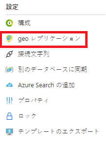
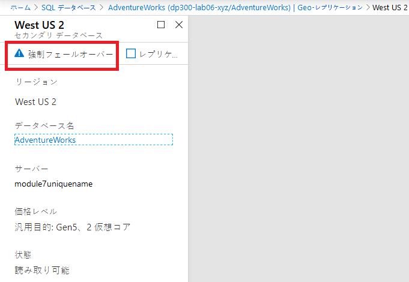

---
lab:
    title: 'ラボ 7 – 高可用性とディザスター リカバリー環境の計画と実装'
    module: '高可用性とディザスター リカバリー環境の計画と実行'
---

# ラボ 7 – 高可用性とディザスター リカバリー環境の計画と実装

**予想時間**: 60 - 90 分

**前提条件**: 演習 1 で使用した Azure SQL データベースは、モジュール 3 のラボで作成されました。 

**ラボ ファイル**: このラボのファイルは、D:\Labfiles\High Availability フォルダーにあります。

# ラボの概要

受講生は 2 つの主要なタスクを実行します。Azure SQL データベースを地理的に冗長化することと、Azure を使用する URL にバックアップして復元することです。 

# ラボの目的

このモジュールを修了すると、次のことができるようになります。

1. Azure SQL Database の geo レプリケーションを有効にする

	- Geo レプリケーションの構成

	- リージョン間でフェールオーバーを実行する

2. URL を使用して SQL Server データベースをバックアップおよび復元する

	- Shared Access Signature (SAS) を作成する

	- URL へのバックアップを構成する

	- データベースを URL にバックアップする

	‐ URL からデータベースを復元する

# シナリオ

前のラボで日常的なタスクを自動化したので、シニア データ エンジニアとして、データベース環境の IaaS と PaaS の両方の構成の可用性を向上させる必要があります。次の目標が課せられています。

1. Azure SQL データベースの geo レプリケーションを有効にして、データベースの可用性を向上させます。

2. データベースを AzureのURL にバックアップし、人為的エラーが発生した後に復元します。


# 演習 1: Azure SQL データベースの geo レプリケーションを有効にする

概要

受講者は、モジュール 2 のラボで作成した Azure SQL データベースの構成を変更して、高可用性を実現します。

ラボの目的

受講生は次のことができるようになります。 

- ポータルを使用して Azure SQL DB の geo レプリケーションを有効にする

- フェールオーバーを含む geo レプリケーションをテストする

シナリオ

WideWorldImporters 内の DBA として、Azure SQL データベースの geo レプリケーションを有効にする方法を理解し、それが機能していることを確認し、ポータルを使用して別のリージョンに手動でフェールオーバーする方法を知っている必要があります。

前提条件

- 受講生用に作成された Azure アカウント – ログイン (電子メール) とパスワードを提供する必要があります

- Azure SQL データベース サーバーと事前作成されたデータベース

 

1. ブラウザー ウィンドウから Azure portal にログインしていない場合は、提供された Azure 資格情報を使用してログインします。

2. 次に示すように、メニューから SQL データベースを選択します。

	

3. ラボ 3 で作成した Azure SQL データベースをクリックします。例をこちらに示します。

	

 

4. データベースのブレードで、「geo レプリケーション」 を選択します。 

	

	データベースが現在構成されている領域は、以下の表のように、白いチェックマークの付いた青い六角形で表されています。geo レプリケーションが構成されていないことがわかります。

	

5. ブレードの下部で、ターゲット リージョンを選択します。利用可能なすべてのリージョンは、緑色の輪郭の六角形になります。

	

6. この例では、「セカンダリの作成」 ブレードに表示されているとおり、米国西部 2  が選択されています。ターゲット サーバーを選択します。

	

7. 「新しいサーバー」 ブレードで、module7geo<unqiueguid>、有効な管理者ログイン、および安全なパスワードを入力します。完了したら、「選択」 をクリックします。

	

8. 「セカンダリの作成」ブレードで 「**OK**」 をクリックします。セカンダリ サーバーとデータベースが作成されます。ステータスを確認するには、ポータル上部のベル アイコンの下を確認します。成功した場合、「デプロイ中」から「デプロイ成功」に進みます。 

	


	また、テーブルのステータス列で、ステータスが「初期化中」から、以下に示すように「シード完了率」になり、レプリケーションが同期されたときに「読み取り可能」になることがわかります。

	

9. Azure SQL データベース が geo レプリケーションで構成されたので、フェールオーバーを実行します。セカンダリ サーバーを選択します (前画像に示すように米国西部2 ですが、別の地域を選択した可能性があります)。

10. ブレードで、「強制フェールオーバー」 をクリックします。

	

11. プロンプトが表示された場合は、「はい」 をクリックします。 

	


	プライマリ レプリカのステータスが 「保留中」、セカンダリ レプリカのステータスが 「フェールオーバー」に切り替わります。このプロセスには数分かかります。完了すると、ロールが切り替わり、セカンダリが新しいプライマリになり、古いプライマリがセカンダリになります。

	


# 演習 2: URL へのバックアップと URL からの復元

予想時間: 15 - 30 分間

この演習のタスクは次のとおりです。

1. URL へのバックアップを構成する

2. WideWorldImporters のバックアップ

3. Restore WideWorldImporters

## タスク 1: URL へのバックアップを構成する

SQL Server のデータベースを Azure にバックアップする前に、いくつかの構成タスクを実行する必要があります。

1. LON-SQL1 のリモート デスクトップ セッションに切り替えます。

2. 開始エッジ。

3. まだログインしていない場合は提供された資格情報を使用して、Azure portal ([https://portal.azure.com](https://portal.azure.com/)) にログインします。 

4. 右上隅にある以下のアイコンを選択して、Cloud Shell プロンプトを開きます。

	

5. まだ Cloud Shell を使用していない場合は、ポータルの下半分に、Azure Cloud Shell へのウェルカム メッセージが表示される場合があります。Bash を選択します。

	

6. 以前に Cloud Shell を使用したことがない場合は、ストレージを提供する必要があります。下のダイアログで 「ストレージの作成」 をクリックします。

	


7. Cloud Shell をすでに使用している場合は、Cloud Shell 画面の上隅に Bash が表示されていることを確認してください。ドロップ ダウン矢印を使用して、PowerShell または Bash を選択できます。 
 

	完了すると、以下のようなプロンプトが表示されます。

	


8. Cloud Shell で次のコマンドを実行して、CLI からストレージ アカウントを作成します。

	```
	az storage account create -n dp300storage -g DP-300-Lab02 --kind StorageV2 -l eastus2
	```

	ストレージ アカウント名は一意で、特殊文字を含まないすべて小文字でなければなりません。上記の dp300storage を dp300storagemsl123 のような一意の名前に変更する必要があります。値 dp300lab06 はリソース グループの名前です。以前のラボで作成したものを使用してください。


	次に、自分のアカウントのアカウント キーを取得します。これは、以降の手順で使用します。Cloud Shell で次のコードを実行します。


	az storage account keys list -g DP-300-Lab02 -n dp300storage


	アカウント キーは上記のコマンドの結果に含まれます。前のコマンドで使用したものと同じ名前 (-n の後) とリソース グループ (-g の後) を使用していることを確認してください。次に示すように、key1 の戻り値 (二重引用符なし) をコピーします。


	
 

9. SQL Server のデータベースを URL にバックアップするには、ストレージ アカウントとその中のコンテナーを使用します。この手順では、バックアップ ストレージ専用のコンテナーを作成します。これを行うには、以下を実行します

	```
	az storage container create --name "backups" --account-name "dp300storage" --account-key "storage_key" --fail-on-exist
	```
 
	ここで、dp300storage はストレージ アカウントの作成時に使用されるストレージ アカウント名であり、storage_key は上記で生成されたキーです。出力は true を返すはずです。

	


10. コンテナーのバックアップが作成されたことをさらに確認するには、次を実行します 

	```
	az storage container list --account-name "dp300storage" --account-key "storage_key"
	```

	ここで、sdp300storage は作成したストレージ アカウント名であり、storage_key は上記で生成したキーです。出力の一部は以下のようなものを返すはずです。

	


11. セキュリティのために、コンテナー レベルの Shared Access Signature (SAS) が必要です。これは、Cloud Shell または PowerShell を介して実行できます。次を実行します。

	```
	az storage container generate-sas -n "backups" --account-name "dp300storage" --account-key "storage_key" --permissions "rwdl" --expiry "date_in_the_future" -o tsv
	```
	

	ここで、dp300storage は上記で作成したストレージ アカウント名、storage_key は上記で生成されたキー、date_in_the_future は現在より後の時間です。date_in_the_future は UTC でなければなりません。例は 2020-05-31T00:00Z で、2020 年 5 月 31 日の午前 0 時に期限切れになります。 


	出力は、次のタスクで使用される以下のようなものを返すはずです。

	


## タスク 2: WideWorldImporters のバックアップ

これで機能が構成されたので、Azure で BLOB としてバックアップ ファイルを生成できます。 

1. SSMS に切り替えて、LON-SQL1 に接続していることを確認します。

2. 「新しいクエリ」 をクリックします。

3. 次の Transact-SQL を使用して、クラウド内のストレージにアクセスするために使用される資格情報を作成します。適切な値を入力します。
	```sql
	IF NOT EXISTS 

	(SELECT * FROM sys.credentials 

	WHERE name = 'https://dp300storage.blob.core.windows.net/backups') 

	BEGIN

	CREATE CREDENTIAL [https://dp300storage.blob.core.windows.net/backups]

	WITH IDENTITY = 'SHARED ACCESS SIGNATURE',

	SECRET = 'sas_token'

	END;

	GO 
	```
	ここで、dp300storage はタスク 1 で作成されたストレージ アカウント名であり、sas_token はステップ 9 で生成された値です。 

4. 「実行」 をクリックします。これは成功するはずです。

5. Transact-SQL で次のコマンドを使用して、データベース WideWorldImporters を Azure にバックアップします。
	```sql
	BACKUP DATABASE WideWorldImporters 

	TO URL = 'https://dp300storage.blob.core.windows.net/backups/WideWorldImporters.bak';

	GO 
	```
	ここで、dp300storage は、タスク 1 で使用したストレージ アカウント名です。

	成功すると、次のようなメッセージが表示されます。

	データベース「WideWorldImporters」、ファイル「WWI_Primary」の 1240 ページをファイル 1 で処理しました

	ファイル 1 のデータベース「WideWorldImporters」、ファイル「WWI_UserData」の 53104 ページを処理しました

	データベース「WideWorldImporters」、ファイル1のファイル「WWI_InMemory_Data_1」の 3865 ページを処理しました

	データベース「WideWorldImporters」、ファイル1のファイル「WWI_Log」の 1468 ページを処理しました。

	BACKUP DATABASE は 14.839 秒 (31.419 MB/秒) で 59677 ページを正常に処理しました。

	完了時間: 5/18/2020 8:01:41 AM

	

	何かが正しく構成されていない場合は、次のようなエラー メッセージが表示されます。

	Msg 3201, Level 16, State 1, Line 33  
	バックアップ デバイス 'https://dp300storage.blob.core.windows.net/container_name/WideWorldImporters.bak' を開けません。オペレーティング システム エラー 50 (要求はサポートされていません。)。  
	Msg 3013, Level 16, State 1, Line 33  
	BACKUP DATABASE が異常終了しています。


	入力ミスがないこと、すべてが正常に作成されていることを確認してください。

6. ファイルが実際に Azure にあることを確認するには、Storage Explorer または Azure Cloud Shell を使用できます。Bash の構文は次のとおりです。 
	```
	az storage blob list -c "backups" --account-name "dp300storage" --account-key "storage_key"
	```
	
	ここで、dp300storage はタスク 1 で使用されるストレージ アカウント名であり、storage_key はそこでも使用されるキーです。出力例を以下に示します。

	

 
## タスク 3: Restore WideWorldImporters

このタスクでは、データベースを復元する方法を示します。


1. クエリ ウィンドウで、次を実行します。 
	```sql
	USE WideWorldImporters;

	GO
	```

2. 次のステートメントを実行して、CustomerID が 1 の Customers テーブルの最初の行を返します。顧客の名前を書き留めます。
	```sql
	SELECT TOP 1 * FROM Sales.Customers;

	GO

	3. Run this command to change the name of that customer.

	UPDATE Sales.Customers

	SET CustomerName = 'This is a human error'

	WHERE CustomerID = 1;

	GO
	```

4. 手順 2 を再実行して、名前が変更されたことを確認します。ここで、誰かが WHERE 句なしで数千または数百万の行を変更したか、間違った WHERE 句があるかを想像してください。

5. データベースを復元して、手順 3 で行った変更前の状態に戻します。
	```sql
	USE master;
	GO

	RESTORE DATABASE WideWorldImporters 

	FROM URL = 'https://dp300storage.blob.core.windows.net/backups/WideWorldImporters.bak';

	GO
	```

	ここで、sp300storage は、タスク 1 で使用したストレージ アカウント名です。

	出力は次のようになります。

	データベース「WideWorldImporters」、ファイル「WWI_Primary」の 1240 ページをファイル 1 で処理しました

	ファイル 1 のデータベース「WideWorldImporters」、ファイル「WWI_UserData」の 53104 ページを処理しました

	データベース「WideWorldImporters」、ファイル1のファイル「WWI_Log」の 1468 ページを処理しました。

	データベース「WideWorldImporters」、ファイル1のファイル「WWI_InMemory_Data_1」の 3865 ページを処理しました

	RESTORE DATABASE は、59,677 ページを 16.167 秒 (28.838 MB/秒) で正常に処理しました。

	完了時間: 5/18/2020 8:35:06 AM

6. WideWorldImporters の復元が完了したら、手順 1 と 2 を再実行します。データは元の場所に戻ります。
